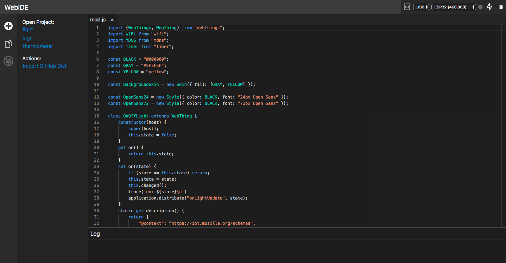
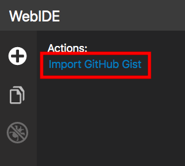
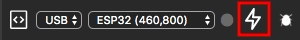
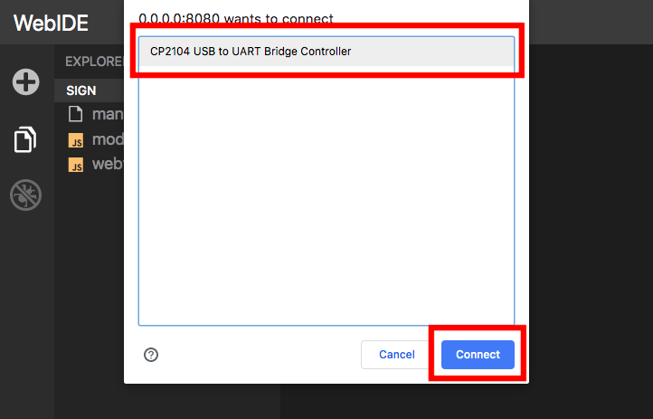
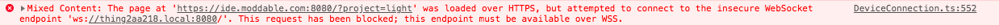

# Scripts & Things Workshop
## Building an IoT Light Switch

This document explains how to build and run JavaScript apps for a network-connected IoT light switch. The light switch is built using a [Moddable Two](https://github.com/Moddable-OpenSource/moddable/blob/public/documentation/devices/moddable-two.md). Apps are installed from a browser-based interface (referred to as the WebIDE in this document). The instructions here assume the Moddable Workshop host application is already installed on the development board.

## Table of Contents

* [About the WebIDE](#webide)
* [About the light switch](#light-switch)
* [Starter apps](#starter-apps)
* [Running examples](#running-examples)
* [Additional resources](#resources)
* [Troubleshooting](#troubleshooting)

<a id="webide"></a>
## About the WebIDE

The WebIDE is a development tool to edit, build, install, run, and debug JavaScript code for microcontrollers using the Moddable SDK.  It allows you to install JavaScript applications built with the Moddable SDK on your device from the browser without having to install any additional software or drivers. It is an alternative to some of the command line build tools in the Moddable SDK.

The WebIDE is available at [moddable-ide.netlify.com/](https://moddable-ide.netlify.com/).



The WebIDE connects can connect to devices using both USB and WebSockets. To connect over USB, it uses [WebUSB](https://developers.google.com/web/updates/2016/03/access-usb-devices-on-the-web). At this time, WebUSB is only implemented in Chrome. If you don't have Chrome already, you can download it [here](https://www.google.com/chrome/).

> The repository for the main project is [on GitHub](https://github.com/FWeinb/moddable-webide). Special thanks to [Fabrice Weinberg](https://github.com/FWeinb) for developing it. The version used for this workshop is also [on GitHub](https://github.com/lprader/moddable-webide).
	
<a id="light-switch"></a>
## About the light switch

The light switch is built with a Moddable Two, which combines an ESP32 with a color capacitive touch screen. When you power on your device, it connects to the `moddable-guest` network and searches for a light bulb. When it finds a light bulb, you'll see the screen shown below.


<a id="starter-apps"></a>
## Starter apps

The following starter apps are provided for you to run and modify.

| | | |
| :---: | :--: | :--- |
|  | Time/Date/Weather | Displays the time, date, location, and weather
|  | Colored Circles | Updates the color of the bulb when you tap colored circles
|  | Motion Sensor | Adds an option to have the light automatically turn on when motion is detected by a PIR sensor

To open an example in the WebIDE, take the following steps.

1. Go to the Projects view in the WebIDE and click **Import GitHub Gist**.

	

3. Enter a name for the project.

	 <!--TO DO: replace these pictures to use one of the names from this tutorial-->
	
4. Enter the gist ID for the example you want to run.
	
	- **Time/Date/Weather**: `68f581c1067a1d71ad7e2f7f5a7bdfec`
	- **Colored Circles**: `1abbd984db8b087db14b49e143d40480`
	- **Motion Sensor**: `a38d385727d03291d892938c59ab359c`
	
	

<a id="running-examples"></a>
## Running examples

You can install examples using WebUSB or WebSockets. Instructions for both options are provided in the sections below.

### WebUSB instructions

To install an example using WebUSB, take the following steps.

1. In the top right corner, select **USB** and **ESP32** from the drop-down menus.

	
	
2. Click the **Flash** button to install the application.

	

	> If you see `NetworkError: Unable to claim interface` traced to the console, see the [troubleshooting section](#vcp-driver).
	
3. Your device will show up as a **CP2104 USB to UART Bridge Controller**. Select the device and click the **Connect** button to connect to it.

	

	> If the popup says `No compatible devices found` see the [troubleshooting section](#vcp-driver).
	
4. If the installation is successful, you will see the following messages traced to the Log at the bottom of the WebIDE.

	
	
	> If you see `File exists` traced to the console, see the [troubleshooting section](#file-exists).
	
### WebSockets instructions

To install an example using WebSockets, take the following steps.

1. Connect your laptop to the `moddable-guest` network.

1. In the top right corner, select **Wi-Fi** from the drop-down menus.

	
	
2. Enter the hostname of your device. The hostname is the name you screen on the main screen of your device with `.local` added to the end, for example `thing2aa218.local`.  <!--TO DO: decide how hostname will be displayed and fix this part of the instructions-->

	
	
3. Click the **Flash** button to install the application.

	
	
4. If the installation is successful, you will see the following messages traced to the Log at the bottom of the WebIDE.

	
	
	> If you see `File exists` traced to the console, see the [troubleshooting section](#file-exists).
	
	> If you never see `Uploading...` traced to the console, see the [troubleshooting section](#no-upload).

<a id="resources"></a>
## Additional resources

The [Moddable SDK](https://github.com/Moddable-OpenSource/moddable) includes many developer resources. The readme at the root of the repository contains an overview of what's there.

The following resources are particularly useful for learning to edit the starter apps provided for this workshop:
 
- The [Piu user interface framework](https://github.com/Moddable-OpenSource/moddable/blob/public/documentation/piu/piu.md) is an object-based framework that makes it easier to create complex, responsive layouts. The examples from this workshop are all built using Piu.

- The [Pins documentation](https://github.com/Moddable-OpenSource/moddable/blob/public/documentation/pins/pins.md) describes the APIs used for various hardware protocols, including all of the ones used in examples from this workshop.

- There are [150+ example apps]((https://github.com/Moddable-OpenSource/moddable/tree/public/examples)) and [extensive documentation](https://github.com/Moddable-OpenSource/moddable/tree/public/documentation) of all the features of the Moddable SDK.

<a id="troubleshooting"></a>
## Troubleshooting

This section lists common issues and how to resolve them.

<a id="vcp-driver"></a>
### `NetworkError: Unable to claim interface` or `No compatible devices found`

If you have the [Silicon Labs VCP Driver](https://www.silabs.com/products/development-tools/software/usb-to-uart-bridge-vcp-drivers) installed, you will get the following error when you try to install an application on your device from the WebIDE:

```
NetworkError: Unable to claim interface.
** Looks like you need to uninstall the driver **
```

You can uninstall the driver by running the uninstall script provided by Silicon Labs. You may have to restart your computer after uninstalling for the change to take effect. Alternatively, you can disable it while you use the WebIDE, then re-enable it when you're done. The next sections explain how to do this on macOS, Windows, and Chrome OS.

#### macOS

To disable the driver:

```
sudo kextunload -b com.silabs.driver.CP210xVCPDriver
```

To bring the driver back:

```
sudo kextload -b com.silabs.driver.CP210xVCPDriver
```

#### Windows

1. Install and open [Zadig](https://zadig.akeo.ie/)

2. Plug in your device via USB

4. Select **Options->List All Devices**

	

5. Select **CP2102 USB to UART Bridge Controller** from the drop down menu

	

6. Select **WinUSB** from the Driver drop down menu and click the **Replace Driver** button

	

7. ***IMPORTANT!*** Restart your computer after the driver is installed

#### Chrome OS

1. Put your Chromebook into developer mode 

	The steps for this may vary for each model. I had success following [these steps](https://www.howtogeek.com/210817/how-to-enable-developer-mode-on-your-chromebook/).

2. Open Crosh by pressing **Ctrl+Alt+T**

3. Open the developer shell by entering the `shell` command

4. Unload the CP210X module

	```
	sudo rmmod cp210x
	```

<a id="file-exists"></a>
### `File exists`

If you see the message `File exists` when you try to install an application, simply refresh the page and try again. You won't lose any saved changes to your example apps.

<a id="no-upload"></a>
### `Uploading...` message never shows in console

If you never see the `Uploading...` message traced to the console, open the JavaScript console in Chrome.


You may see a Mixed Content error like in the following image. 


If so, take the following steps:

1. Click the Insecure Content warning icon in the URL bar.

	

2. Click "Load Unsafe Scripts" in the popup to give the site permission to connect to the device.

	

You may see an ERR\_NAME\_NOT\_RESOLVED error like in the following image.


If so, make sure you entered the correct hostname in the WebIDE and your device is connected to the same Wi-Fi network as your laptop.